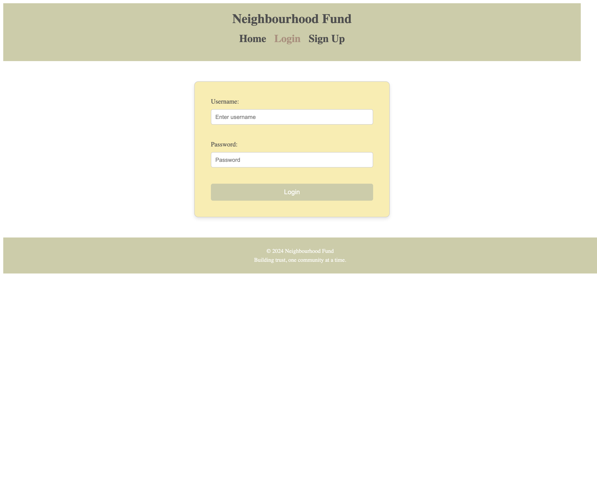

# Neighbourhood Fund

A crowdfunding platform for community projects.

## Live Site
[Visit the Live Site](https://symphonious-caramel-efcc51.netlify.app/)

## Screenshots
1. Homepage  
   **After Login:**  
     
   **Before Login:**  
   

2. Login Page  
   

3. Create Project Form  
   

4. Create a plede/project
   

# React + Vite
This template provides a minimal setup to get React working in Vite with HMR and some ESLint rules.

Currently, two official plugins are available:

- [@vitejs/plugin-react](https://github.com/vitejs/vite-plugin-react/blob/main/packages/plugin-react/README.md) uses [Babel](https://babeljs.io/) for Fast Refresh
- [@vitejs/plugin-react-swc](https://github.com/vitejs/vite-plugin-react-swc) uses [SWC](https://swc.rs/) for Fast Refresh
